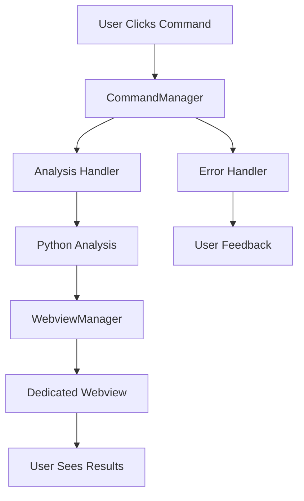

# Design Document

## Overview

The DoraCodeBirdView extension currently has a well-structured architecture with command handlers, webview managers, and Python integration, but there are critical issues preventing the analysis commands from displaying results to users. The main problems identified are:

1. **Missing WebviewManager Integration**: Command handlers exist but don't properly integrate with the WebviewManager
2. **HTML Service vs Webview Confusion**: Commands try to render results via HTMLViewService instead of dedicated webviews
3. **Git Analytics Command Duplication**: Multiple git-related commands may exist causing user confusion
4. **Error Handling Gaps**: Insufficient user feedback when webviews fail to display

This design addresses these issues by fixing the command-to-webview integration, consolidating git analytics options, and improving error handling and user feedback.

## Architecture

### Current Architecture Analysis
The extension has a solid foundation with:
- **Command Handlers**: Separate handlers for each analysis type with Python integration
- **WebviewManager**: Manages dedicated webviews for each analysis type
- **Error Handling**: Comprehensive error logging and user feedback system
- **State Management**: Tracks analysis state and prevents duplicate calls

### Root Cause Analysis
The primary issue is in the `CommandManager.handleXXXAnalysis()` methods which call `htmlViewService.renderAnalysisResult()` instead of using the `WebviewManager` that's designed for this purpose. The webview infrastructure exists but isn't being used.

### Proposed Architecture Changes



## Components and Interfaces

### 1. Command Manager Integration Fix

**Problem**: CommandManager doesn't use WebviewManager for displaying results.

**Solution**: Modify CommandManager to inject WebviewManager into command handlers and use it for result display.

**Interface Changes**:
```typescript
// CommandManager constructor update
constructor(
  context: vscode.ExtensionContext,
  errorHandler: ErrorHandler,
  duplicateCallGuard: DuplicateCallGuard,
  stateManager: AnalysisStateManager,
  webviewManager: WebviewManager  // Add this parameter
)

// Handler initialization update
this.fullCodeAnalysisHandler = new FullCodeAnalysisHandler(
  errorHandler,
  duplicateCallGuard,
  stateManager,
  webviewManager  // Pass webviewManager
);
```

### 2. Command Handler Updates

**Problem**: Handlers have WebviewManager parameter but it's not being passed from CommandManager.

**Solution**: Ensure all handlers receive WebviewManager instance and use it consistently.

**Key Changes**:
- Remove HTMLViewService calls from command handlers
- Use WebviewManager.showXXXAnalysis() methods directly
- Ensure proper error handling when webviews fail

### 3. Git Analytics Consolidation

**Problem**: Potential multiple git analytics commands causing confusion.

**Solution**: Ensure single, clear git analytics command registration.

**Implementation**:
- Audit package.json for duplicate git-related commands
- Consolidate to single `doracodebirdview.analyzeGitAnalytics` command
- Update command title to be clear and descriptive

### 4. Enhanced Error Handling

**Problem**: Users don't get clear feedback when webviews fail to display.

**Solution**: Add comprehensive error handling with user-friendly messages.

**Error Handling Strategy**:
- Validate webview creation success
- Provide fallback error messages when webviews fail
- Log detailed errors for debugging
- Offer retry options to users

## Data Models

### Analysis Result Validation

Enhance result validation to ensure data compatibility with webviews:

```typescript
interface AnalysisResultValidator {
  validateFullCodeResult(result: any): boolean;
  validateCurrentFileResult(result: any): boolean;
  validateGitAnalyticsResult(result: any): boolean;
  getValidationErrors(result: any): string[];
}
```

### Webview State Tracking

Track webview states for better error handling:

```typescript
interface WebviewState {
  isVisible: boolean;
  lastUpdate: Date;
  hasError: boolean;
  errorMessage?: string;
}
```

## Error Handling

### 1. Webview Creation Failures

**Scenario**: Webview fails to create or display
**Handling**: 
- Log detailed error information
- Show user-friendly error message
- Offer alternative viewing options (e.g., JSON output)

### 2. Analysis Data Validation Failures

**Scenario**: Python analysis returns invalid or empty data
**Handling**:
- Validate data structure before passing to webview
- Show specific error about what data is missing
- Suggest troubleshooting steps

### 3. Python Service Unavailable

**Scenario**: Python analyzer cannot be executed
**Handling**:
- Check Python availability before command execution
- Provide clear installation instructions
- Offer to open troubleshooting documentation

### 4. Command Execution Failures

**Scenario**: Command handler throws unexpected errors
**Handling**:
- Catch all errors at command level
- Reset analysis state properly
- Provide retry mechanism

## Testing Strategy

### 1. Integration Testing

**Test Scenarios**:
- Full code analysis command → webview display
- Current file analysis command → webview display  
- Git analytics command → webview display
- Error scenarios for each command type

**Test Implementation**:
- Mock Python service responses
- Verify webview creation and content
- Test error handling paths

### 2. User Experience Testing

**Test Scenarios**:
- Command execution with progress feedback
- Error message clarity and actionability
- Webview responsiveness and content accuracy

### 3. Command Registration Testing

**Test Scenarios**:
- Verify only one git analytics command is registered
- Confirm all commands are properly registered
- Test command availability in command palette

### 4. State Management Testing

**Test Scenarios**:
- Proper state cleanup after command execution
- Duplicate call prevention
- State consistency during errors

## Implementation Plan

### Phase 1: Core Integration Fix
1. Update CommandManager constructor to accept WebviewManager
2. Modify command handlers to use WebviewManager instead of HTMLViewService
3. Update extension.ts to properly initialize WebviewManager

### Phase 2: Git Analytics Consolidation
1. Audit package.json for git-related commands
2. Remove duplicate command registrations
3. Ensure single, clear git analytics command

### Phase 3: Enhanced Error Handling
1. Add webview creation validation
2. Implement comprehensive error messages
3. Add retry mechanisms for failed operations

### Phase 4: Testing and Validation
1. Create integration tests for command-to-webview flow
2. Test error scenarios and user feedback
3. Validate command registration and availability

## Success Criteria

1. **Functional Commands**: All analysis commands display results in webviews
2. **Single Git Analytics**: Only one git analytics option in command palette
3. **Clear Error Messages**: Users receive actionable feedback on failures
4. **Consistent Experience**: All commands follow same execution and display pattern
5. **Proper State Management**: No hanging processes or inconsistent states

## Risk Mitigation

### Risk: Breaking Existing Functionality
**Mitigation**: Incremental changes with thorough testing at each step

### Risk: Webview Performance Issues
**Mitigation**: Validate data size and structure before rendering

### Risk: Python Service Dependencies
**Mitigation**: Enhanced dependency validation and user guidance

### Risk: User Experience Regression
**Mitigation**: Maintain existing command names and behavior patterns