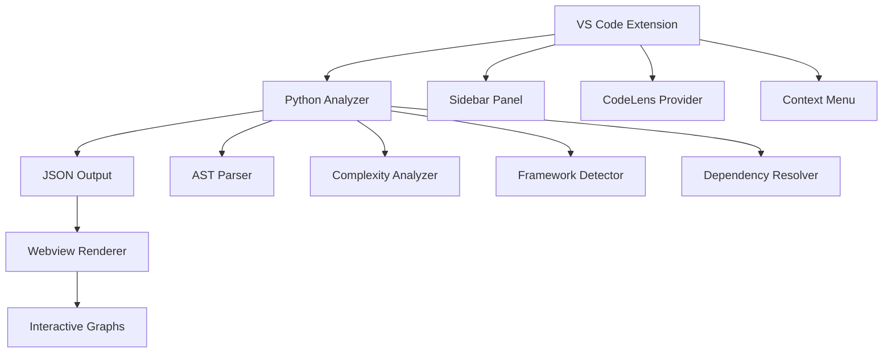
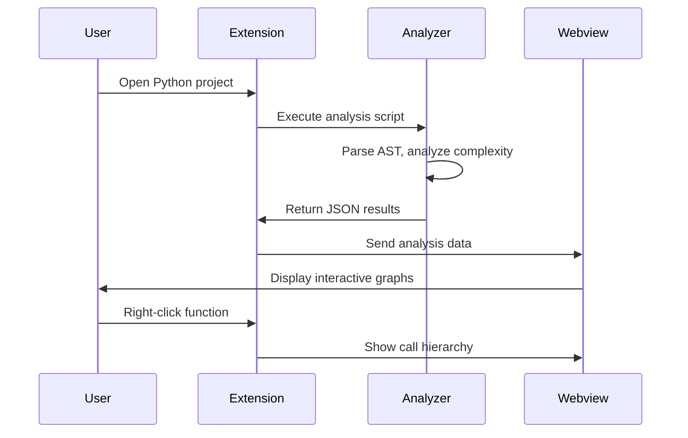

# Design Document

## Overview

CodeMindMap is a VS Code extension that combines a Python-based static analysis engine with a TypeScript-based VS Code integration layer. The architecture follows a client-server pattern where the Python analyzer acts as the analysis engine, and the TypeScript extension provides the user interface and VS Code integration.

The system consists of three main components:
1. **Python Analyzer**: Static analysis engine using AST parsing and complexity analysis
2. **VS Code Extension**: TypeScript-based extension providing UI and integration
3. **Webview Visualization**: Interactive graph rendering using web technologies

## Architecture

### High-Level Architecture



### Component Interaction Flow



## Components and Interfaces

### 1. Python Analyzer (`analyzer.py`)

**Purpose**: Static analysis engine that parses Python code and extracts structural information.

**Key Classes**:
- `ProjectAnalyzer`: Main orchestrator class
- `ASTParser`: Handles Python AST parsing and traversal
- `ComplexityAnalyzer`: Calculates code complexity using radon
- `DependencyResolver`: Resolves import relationships
- `FrameworkDetector`: Detects Django/Flask/FastAPI patterns

**Core Methods**:
```python
class ProjectAnalyzer:
    def analyze_project(self, project_path: str) -> AnalysisResult
    def detect_tech_stack(self, project_path: str) -> TechStack
    def build_module_graph(self, modules: List[Module]) -> ModuleGraph
    def build_call_graph(self, functions: List[Function]) -> CallGraph
```

**Dependencies**:
- `ast`: Python AST parsing
- `radon`: Complexity analysis
- `pathlib`: File system operations
- `json`: Output serialization
- `typing`: Type annotations

### 2. VS Code Extension (`extension.ts`)

**Purpose**: Main extension entry point and VS Code API integration.

**Key Classes**:
- `CodeMindMapExtension`: Main extension class
- `SidebarProvider`: Manages sidebar panel
- `WebviewProvider`: Manages graph visualization webview
- `CodeLensProvider`: Provides complexity annotations
- `ContextMenuProvider`: Handles right-click actions

**Core Methods**:
```typescript
export class CodeMindMapExtension {
    activate(context: vscode.ExtensionContext): void
    runAnalysis(workspacePath: string): Promise<AnalysisResult>
    showCallHierarchy(functionName: string, position: vscode.Position): void
    updateWebview(analysisData: AnalysisResult): void
}
```

**VS Code API Integration**:
- `vscode.window.createWebviewPanel`: Graph visualization
- `vscode.window.registerTreeDataProvider`: Sidebar panel
- `vscode.languages.registerCodeLensProvider`: Complexity annotations
- `vscode.commands.registerCommand`: Context menu commands

### 3. Webview Visualization

**Purpose**: Interactive graph rendering and user interaction handling.

**Technology Stack**:
- **Cytoscape.js**: Graph visualization library
- **HTML5 Canvas**: High-performance rendering
- **CSS3**: Styling and animations
- **TypeScript**: Type-safe interaction logic

**Key Features**:
- Zoomable and pannable module graphs
- Interactive call hierarchy trees
- Color-coded complexity indicators
- Search and filtering capabilities

## Data Models

### Analysis Result Structure

```typescript
interface AnalysisResult {
    techStack: TechStack;
    modules: ModuleGraph;
    functions: CallGraph;
    frameworks: FrameworkPatterns;
    metadata: AnalysisMetadata;
}

interface TechStack {
    libraries: Library[];
    pythonVersion: string;
    frameworks: string[];
    packageManager: 'pip' | 'poetry' | 'pipenv';
}

interface ModuleGraph {
    nodes: ModuleNode[];
    edges: ModuleEdge[];
}

interface ModuleNode {
    id: string;
    name: string;
    path: string;
    complexity: ComplexityScore;
    size: number;
    functions: string[];
}

interface ModuleEdge {
    source: string;
    target: string;
    type: 'import' | 'dependency';
    weight: number;
}

interface CallGraph {
    nodes: FunctionNode[];
    edges: CallEdge[];
}

interface FunctionNode {
    id: string;
    name: string;
    module: string;
    complexity: number;
    lineNumber: number;
    parameters: Parameter[];
}

interface CallEdge {
    caller: string;
    callee: string;
    callCount: number;
    lineNumbers: number[];
}
```

### Framework Pattern Models

```typescript
interface FrameworkPatterns {
    django?: DjangoPatterns;
    flask?: FlaskPatterns;
    fastapi?: FastAPIPatterns;
}

interface DjangoPatterns {
    urlPatterns: URLPattern[];
    views: ViewMapping[];
    models: ModelMapping[];
    serializers: SerializerMapping[];
}

interface URLPattern {
    pattern: string;
    viewName: string;
    viewFunction: string;
    namespace?: string;
}

interface FlaskPatterns {
    routes: FlaskRoute[];
    blueprints: Blueprint[];
}

interface FastAPIPatterns {
    routes: FastAPIRoute[];
    dependencies: DependencyMapping[];
}
```

## Error Handling

### Python Analyzer Error Handling

1. **File System Errors**:
   - Handle missing files gracefully
   - Provide informative error messages
   - Continue analysis with available files

2. **Parsing Errors**:
   - Catch and log AST parsing failures
   - Skip problematic files and continue
   - Report parsing issues in JSON output

3. **Dependency Resolution Errors**:
   - Handle missing imports gracefully
   - Provide warnings for unresolved dependencies
   - Continue with partial dependency graph

**Error Response Format**:
```json
{
    "success": false,
    "errors": [
        {
            "type": "parsing_error",
            "file": "path/to/file.py",
            "message": "Syntax error on line 42",
            "line": 42
        }
    ],
    "warnings": [
        {
            "type": "unresolved_import",
            "module": "missing_module",
            "importedBy": ["file1.py", "file2.py"]
        }
    ]
}
```

### VS Code Extension Error Handling

1. **Python Execution Errors**:
   - Check Python availability
   - Provide installation guidance
   - Fallback to basic analysis if dependencies missing

2. **Webview Errors**:
   - Handle webview creation failures
   - Provide error messages in sidebar
   - Graceful degradation to text-based output

3. **Performance Issues**:
   - Implement analysis timeouts
   - Provide cancellation options
   - Show progress indicators

## Testing Strategy

### Python Analyzer Testing

1. **Unit Tests**:
   - Test individual analyzer components
   - Mock file system operations
   - Validate JSON output structure
   - Test framework detection logic

2. **Integration Tests**:
   - Test with real Python projects
   - Validate end-to-end analysis flow
   - Test with different project structures
   - Performance benchmarking

**Test Framework**: `pytest` with `pytest-mock` for mocking

### VS Code Extension Testing

1. **Unit Tests**:
   - Test extension activation
   - Mock VS Code API calls
   - Test command registration
   - Validate webview communication

2. **Integration Tests**:
   - Test with VS Code Extension Test Runner
   - Validate user interaction flows
   - Test with sample Python projects
   - Cross-platform compatibility testing

**Test Framework**: `mocha` with VS Code Extension Test Runner

### End-to-End Testing

1. **Manual Testing Scenarios**:
   - Test with Django sample project
   - Test with Flask sample project
   - Test with FastAPI sample project
   - Test with large codebases (1000+ files)

2. **Automated E2E Tests**:
   - Automated extension installation
   - Project analysis workflows
   - Graph interaction testing
   - Performance regression testing

## Performance Considerations

### Analysis Performance

1. **Incremental Analysis**:
   - Cache analysis results
   - Only re-analyze changed files
   - Use file modification timestamps

2. **Memory Management**:
   - Stream large file processing
   - Implement garbage collection for AST objects
   - Limit concurrent file processing

3. **Parallel Processing**:
   - Analyze modules in parallel
   - Use multiprocessing for CPU-intensive tasks
   - Implement work queues for large projects

### Visualization Performance

1. **Graph Rendering Optimization**:
   - Use Cytoscape.js performance extensions
   - Implement level-of-detail rendering
   - Lazy loading for large graphs

2. **Data Transfer Optimization**:
   - Compress JSON data transfer
   - Implement progressive loading
   - Use efficient serialization formats

## Security Considerations

1. **Code Execution Safety**:
   - Never execute analyzed Python code
   - Sandbox Python analyzer execution
   - Validate file paths to prevent directory traversal

2. **Data Privacy**:
   - Keep analysis data local
   - No external network requests
   - Clear sensitive data from memory

3. **Extension Security**:
   - Follow VS Code extension security guidelines
   - Validate all user inputs
   - Implement proper error boundaries