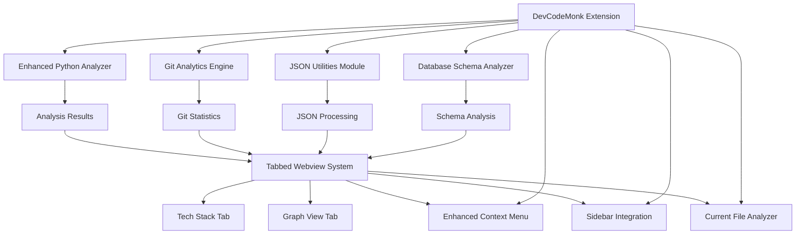
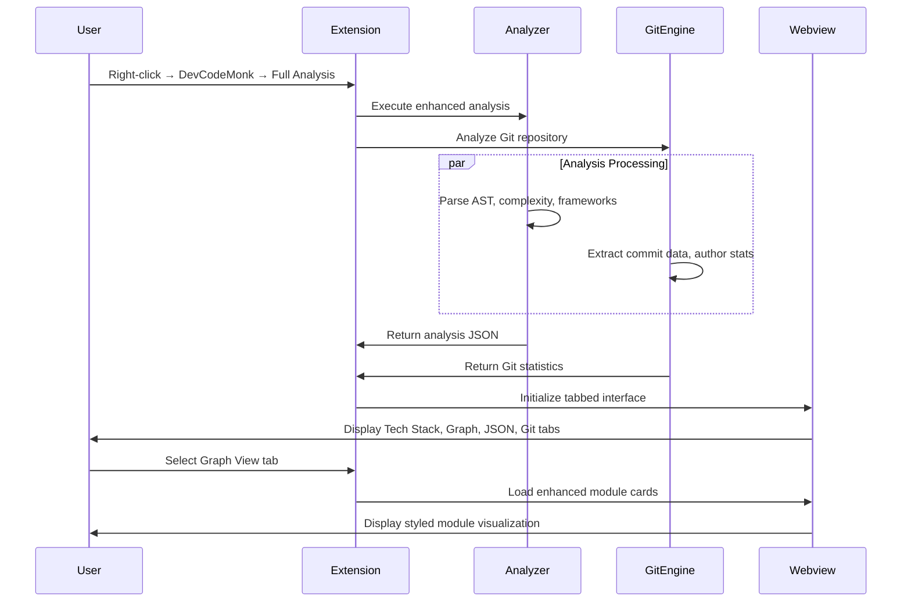

# Design Document

## Overview

DoraCodeBirdView is an advanced VS Code extension that transforms the existing CodeMindMap foundation into a comprehensive code analysis and visualization platform. The architecture maintains the proven client-server pattern with a Python analysis engine and TypeScript VS Code integration, while adding significant enhancements for Git analytics, improved visualizations, JSON utilities, and enhanced user experience.

The system consists of six main components:
1. **Enhanced Python Analyzer**: Extended static analysis engine with Git integration
2. **VS Code Extension**: Redesigned TypeScript extension with tabbed interfaces
3. **Advanced Webview System**: Multi-view visualization with enhanced styling
4. **Git Analytics Engine**: Comprehensive Git repository analysis
5. **JSON Utilities Module**: Integrated JSON processing and visualization tools
6. **Database Schema Analyzer**: Database schema analysis with graph and SQL views

## Architecture

### High-Level Architecture



### Component Interaction Flow



## Components and Interfaces

### 1. Enhanced Python Analyzer

**Purpose**: Extended static analysis engine with improved module detection and framework analysis.

**New Classes**:
- `ModuleCardGenerator`: Creates styled module representations
- `FolderStructureAnalyzer`: Analyzes project folder organization
- `EnhancedComplexityAnalyzer`: Advanced complexity metrics with visualization data

**Enhanced Core Methods**:
```python
class ProjectAnalyzer:
    def analyze_project_enhanced(self, project_path: str) -> EnhancedAnalysisResult
    def generate_module_cards(self, modules: List[Module]) -> List[ModuleCard]
    def analyze_folder_structure(self, project_path: str) -> FolderStructure
    def get_current_file_analysis(self, file_path: str) -> FileAnalysisResult
```

**New Data Structures**:
```python
@dataclass
class ModuleCard:
    id: str
    name: str
    folder_path: str
    display_name: str
    complexity_score: float
    file_count: int
    dependencies: List[str]
    styling: CardStyling
    position: Optional[Position]

@dataclass
class CardStyling:
    background_color: str
    border_color: str
    text_color: str
    complexity_indicator: str
    size_class: str
```

### 2. Git Analytics Engine

**Purpose**: Comprehensive Git repository analysis for author contributions and commit statistics.

**Key Classes**:
- `GitAnalyzer`: Main Git analysis orchestrator
- `AuthorContributionTracker`: Tracks per-author statistics
- `ModuleCommitAnalyzer`: Analyzes commits per module/folder
- `CommitStatisticsGenerator`: Generates statistical reports

**Core Methods**:
```python
class GitAnalyzer:
    def analyze_repository(self, repo_path: str) -> GitAnalysisResult
    def get_author_contributions(self, module_path: str) -> List[AuthorContribution]
    def get_commit_statistics(self, date_range: Optional[DateRange]) -> CommitStatistics
    def generate_contribution_graph_data(self) -> GraphData
```

**Git Data Models**:
```python
@dataclass
class GitAnalysisResult:
    repository_info: RepositoryInfo
    author_contributions: List[AuthorContribution]
    module_statistics: Dict[str, ModuleGitStats]
    commit_timeline: List[CommitTimelineEntry]
    overall_statistics: OverallGitStats

@dataclass
class AuthorContribution:
    author_name: str
    author_email: str
    total_commits: int
    lines_added: int
    lines_removed: int
    modules_touched: List[str]
    first_commit: datetime
    last_commit: datetime
    contribution_percentage: float

@dataclass
class ModuleGitStats:
    module_path: str
    total_commits: int
    unique_authors: int
    lines_added: int
    lines_removed: int
    author_breakdown: List[AuthorContribution]
    commit_frequency: Dict[str, int]  # month -> commit_count
```

### 3. Enhanced VS Code Extension

**Purpose**: Redesigned extension with tabbed interfaces and improved user experience.

**New Classes**:
- `TabbedWebviewProvider`: Manages multi-tab analysis interface
- `ContextMenuManager`: Handles enhanced context menu structure
- `CurrentFileAnalyzer`: Provides single-file analysis capabilities
- `JsonUtilitiesProvider`: Manages JSON formatting and tree view

**Enhanced Core Methods**:
```typescript
export class DevCodeMonkExtension {
    activateEnhanced(context: vscode.ExtensionContext): void
    showFullAnalysis(workspacePath: string): Promise<void>
    showCurrentFileAnalysis(filePath: string): Promise<void>
    showGitAnalytics(workspacePath: string): Promise<void>
    formatJsonInEditor(): Promise<void>
    showJsonTreeView(jsonContent: string): Promise<void>
}

export class TabbedWebviewProvider {
    createTabbedInterface(analysisData: EnhancedAnalysisResult): void
    switchToTab(tabName: 'techstack' | 'graph' | 'json' | 'git'): void
    updateTabContent(tabName: string, content: any): void
}
```

### 4. JSON Utilities Module

**Purpose**: Integrated JSON processing, formatting, and visualization capabilities.

**Key Classes**:
- `JsonFormatter`: Handles JSON beautification and validation
- `JsonTreeViewProvider`: Creates expandable tree representations
- `JsonValidator`: Validates and provides error diagnostics

**Core Methods**:
```typescript
export class JsonUtilities {
    formatJson(content: string): Promise<string>
    validateJson(content: string): JsonValidationResult
    generateTreeView(jsonObject: any): TreeViewData
    exportJsonAnalysis(analysisData: any): string
}

interface JsonValidationResult {
    isValid: boolean
    errors: JsonError[]
    formattedContent?: string
}

interface TreeViewData {
    nodes: TreeNode[]
    expandedPaths: string[]
    searchableContent: string
}
```

### 5. Database Schema Analyzer

**Purpose**: Comprehensive database schema analysis with visual graph representation and raw SQL extraction.

**Key Classes**:
- `DatabaseSchemaAnalyzer`: Main schema analysis orchestrator
- `ModelRelationshipExtractor`: Extracts relationships from Django/SQLAlchemy models
- `SQLSchemaParser`: Parses SQL files and migration scripts
- `SchemaGraphGenerator`: Creates visual schema representations

**Core Methods**:
```python
class DatabaseSchemaAnalyzer:
    def analyze_database_schema(self, project_path: str) -> SchemaAnalysisResult
    def extract_model_relationships(self, models_path: str) -> List[ModelRelationship]
    def parse_sql_files(self, sql_path: str) -> List[SQLTable]
    def generate_schema_graph_data(self, tables: List[SQLTable]) -> SchemaGraphData
    def extract_raw_sql(self, project_path: str) -> List[SQLStatement]
```

**Database Data Models**:
```python
@dataclass
class SchemaAnalysisResult:
    tables: List[SQLTable]
    relationships: List[TableRelationship]
    indexes: List[DatabaseIndex]
    constraints: List[DatabaseConstraint]
    raw_sql: List[SQLStatement]
    graph_data: SchemaGraphData
    metadata: SchemaMetadata

@dataclass
class SQLTable:
    name: str
    schema: str
    columns: List[TableColumn]
    primary_keys: List[str]
    foreign_keys: List[ForeignKey]
    indexes: List[str]
    constraints: List[str]
    estimated_rows: Optional[int]

@dataclass
class TableColumn:
    name: str
    data_type: str
    nullable: bool
    default_value: Optional[str]
    max_length: Optional[int]
    is_primary_key: bool
    is_foreign_key: bool

@dataclass
class TableRelationship:
    from_table: str
    to_table: str
    relationship_type: str  # 'one-to-one', 'one-to-many', 'many-to-many'
    foreign_key_column: str
    referenced_column: str

@dataclass
class SQLStatement:
    statement_type: str  # 'CREATE', 'ALTER', 'INSERT', etc.
    content: str
    file_path: str
    line_number: int
    table_references: List[str]
```

### 6. Advanced Webview System

**Purpose**: Multi-view visualization system with enhanced styling and interactivity.

**Technology Stack**:
- **Cytoscape.js**: Enhanced graph visualization with custom styling
- **D3.js**: Git analytics charts and statistics visualization
- **CSS Grid/Flexbox**: Responsive tabbed interface layout
- **Chart.js**: Commit timeline and contribution charts

**Enhanced Features**:
- Tabbed interface with smooth transitions
- Module cards with CSS styling (shadows, borders, hover effects)
- Interactive Git analytics dashboards
- Database schema graph visualization with table relationships
- Raw SQL viewer with syntax highlighting
- Responsive design for different panel sizes
- Export capabilities for visualizations and SQL schemas

## Data Models

### Enhanced Analysis Result Structure

```typescript
interface EnhancedAnalysisResult {
    projectInfo: ProjectInfo;
    techStack: TechStack;
    moduleCards: ModuleCard[];
    folderStructure: FolderStructure;
    callGraph: CallGraph;
    gitAnalytics: GitAnalysisResult;
    schemaAnalysis: SchemaAnalysisResult;
    currentFileAnalysis?: FileAnalysisResult;
    exportMetadata: ExportMetadata;
}

interface ProjectInfo {
    name: string;
    path: string;
    totalFiles: number;
    totalLines: number;
    analysisTimestamp: string;
    devCodeMonkVersion: string;
}

interface ModuleCard {
    id: string;
    name: string;
    displayName: string;
    folderPath: string;
    complexity: ComplexityMetrics;
    dependencies: ModuleDependency[];
    styling: CardStyling;
    position: Position;
    metadata: ModuleMetadata;
}

interface ComplexityMetrics {
    overall: number;
    cyclomatic: number;
    maintainability: number;
    colorCode: 'green' | 'orange' | 'red';
    trend: 'improving' | 'stable' | 'degrading';
}

interface CardStyling {
    backgroundColor: string;
    borderColor: string;
    borderWidth: number;
    borderRadius: number;
    shadowStyle: string;
    textColor: string;
    fontSize: string;
    padding: string;
    minWidth: number;
    minHeight: number;
}

interface FolderStructure {
    rootPath: string;
    folders: FolderNode[];
    moduleGroupings: ModuleGrouping[];
}

interface FolderNode {
    path: string;
    name: string;
    type: 'app' | 'module' | 'package' | 'utility';
    children: FolderNode[];
    moduleCount: number;
    complexity: number;
}
```

### Git Analytics Data Models

```typescript
interface GitAnalysisResult {
    repositoryInfo: {
        name: string;
        branch: string;
        totalCommits: number;
        dateRange: DateRange;
        contributors: number;
    };
    authorContributions: AuthorContribution[];
    moduleStatistics: ModuleGitStats[];
    commitTimeline: CommitTimelineEntry[];
    contributionGraphs: ContributionGraphData[];
}

interface ContributionGraphData {
    type: 'commits' | 'lines_added' | 'lines_removed';
    data: {
        labels: string[];
        datasets: {
            label: string;
            data: number[];
            backgroundColor: string;
            borderColor: string;
        }[];
    };
}
```

## User Interface Design

### Enhanced Context Menu Structure

```
Right-click on Python file:
├── DevCodeMonk ►
│   ├── Full Code Analysis ►
│   │   ├── Tech Stack
│   │   ├── Graph View
│   │   └── JSON View
│   ├── Current File Analysis ►
│   │   ├── Tech Stack
│   │   ├── Graph View
│   │   └── JSON View
│   ├── Call Hierarchy ►
│   │   ├── Graph View
│   │   └── JSON View
│   ├── Git Commits ►
│   │   ├── Author Statistics
│   │   ├── Module Contributions
│   │   └── Commit Timeline
│   ├── DB Schema ►
│   │   ├── Graph View
│   │   └── Raw SQL
│   └── JSON Utils ►
│       ├── JSON Format
│       └── JSON Tree View
└── Other VS Code options...
```

### Tabbed Interface Layout

```
┌─────────────────────────────────────────────────────────────┐
│ DevCodeMonk Analysis - ProjectName                          │
├─────────────────────────────────────────────────────────────┤
│ [Tech Stack] [Graph View] [JSON View] [Git Analytics] [DB Schema] │
├─────────────────────────────────────────────────────────────┤
│                                                             │
│  Tab Content Area:                                          │
│  - Tech Stack: Libraries, frameworks, dependencies         │
│  - Graph View: Enhanced module cards with styling          │
│  - JSON View: Formatted analysis data                      │
│  - Git Analytics: Author stats, commit graphs              │
│  - DB Schema: Database schema with sub-tabs:               │
│    └── [Graph View] [Raw SQL]                              │
│                                                             │
└─────────────────────────────────────────────────────────────┘
```

### Module Card Styling

```css
.module-card {
    background: linear-gradient(135deg, #f5f7fa 0%, #c3cfe2 100%);
    border: 2px solid #e1e8ed;
    border-radius: 8px;
    box-shadow: 0 4px 6px rgba(0, 0, 0, 0.1);
    padding: 16px;
    min-width: 200px;
    min-height: 120px;
    transition: all 0.3s ease;
}

.module-card:hover {
    transform: translateY(-2px);
    box-shadow: 0 8px 15px rgba(0, 0, 0, 0.2);
}

.module-card.complexity-high {
    border-color: #e74c3c;
    background: linear-gradient(135deg, #ffeaa7 0%, #fab1a0 100%);
}

.module-card.complexity-medium {
    border-color: #f39c12;
    background: linear-gradient(135deg, #ffecd2 0%, #fcb69f 100%);
}

.module-card.complexity-low {
    border-color: #27ae60;
    background: linear-gradient(135deg, #a8edea 0%, #fed6e3 100%);
}
```

## Error Handling

### Enhanced Error Management

1. **Analysis Errors**:
   - Graceful degradation when components fail
   - Partial results display with error indicators
   - User-friendly error messages with actionable suggestions
   - Automatic retry mechanisms for transient failures

2. **Git Analytics Errors**:
   - Handle repositories without Git history
   - Manage large repository performance issues
   - Provide offline mode when Git operations fail
   - Clear messaging for permission issues

3. **JSON Utilities Errors**:
   - Validate JSON before processing
   - Provide syntax error highlighting
   - Suggest corrections for common JSON mistakes
   - Handle large JSON files with streaming

**Error Response Format**:
```json
{
    "success": boolean,
    "partialResults": boolean,
    "data": AnalysisResult | null,
    "errors": [
        {
            "component": "analyzer" | "git" | "json" | "webview",
            "type": "parsing_error" | "git_error" | "json_error" | "ui_error",
            "severity": "error" | "warning" | "info",
            "message": string,
            "suggestion": string,
            "file": string,
            "line": number
        }
    ],
    "metadata": {
        "analysisTime": number,
        "componentsAnalyzed": string[],
        "componentsFailed": string[]
    }
}
```

## Testing Strategy

### Comprehensive Testing Approach

1. **Unit Testing**:
   - Python analyzer components with pytest
   - TypeScript extension components with mocha
   - Git analytics with mock repositories
   - JSON utilities with various JSON formats

2. **Integration Testing**:
   - End-to-end analysis workflows
   - Tabbed interface interactions
   - Context menu functionality
   - Git repository integration

3. **Visual Testing**:
   - Module card rendering across themes
   - Graph layout and styling
   - Responsive design testing
   - Cross-platform UI consistency

4. **Performance Testing**:
   - Large repository analysis
   - Memory usage optimization
   - Git analytics on extensive histories
   - Webview rendering performance

## Performance Considerations

### Optimization Strategies

1. **Analysis Performance**:
   - Incremental analysis with smart caching
   - Parallel processing for independent components
   - Lazy loading for large datasets
   - Background processing with progress indicators

2. **Git Analytics Performance**:
   - Efficient Git log parsing
   - Cached author statistics
   - Streaming for large repositories
   - Configurable analysis depth

3. **Visualization Performance**:
   - Virtual scrolling for large module lists
   - Level-of-detail rendering for complex graphs
   - Optimized CSS animations
   - Efficient DOM updates

4. **Memory Management**:
   - Cleanup of unused analysis data
   - Efficient data structures
   - Garbage collection optimization
   - Resource monitoring and limits

## Security Considerations

1. **Code Analysis Safety**:
   - Sandboxed Python execution
   - No code execution during analysis
   - Safe file path handling
   - Input validation for all user data

2. **Git Data Privacy**:
   - Local-only Git analysis
   - No external network requests
   - Secure handling of author information
   - Optional anonymization features

3. **Extension Security**:
   - Content Security Policy for webviews
   - Secure inter-component communication
   - Proper error boundary implementation
   - Regular security dependency updates