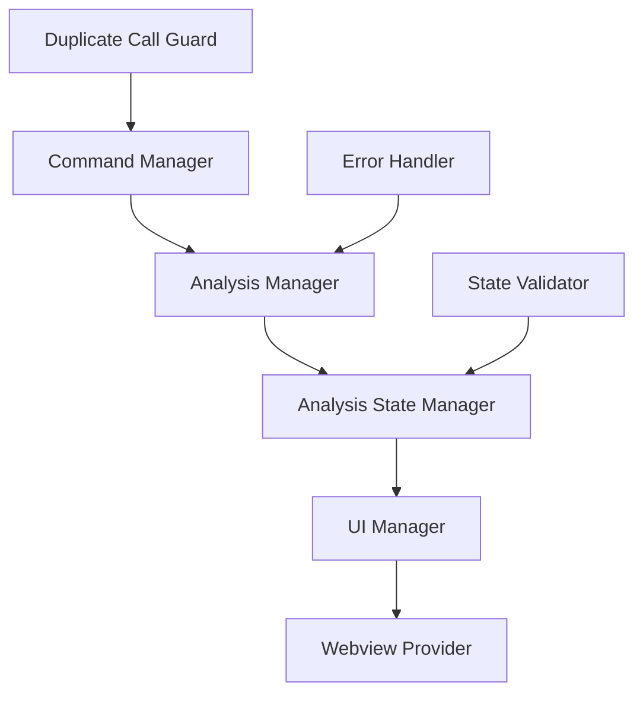

# Design Document

## Overview

The VS Code extension is experiencing critical issues with duplicate analysis calls and null reference errors in the command manager. The root causes identified are:

1. **Multiple Command Managers**: Both `command-manager.ts` and `command-manager.new.ts` exist, potentially causing conflicts
2. **Null Reference Errors**: Command manager tries to read properties from null analysis results
3. **Lack of Duplicate Call Prevention**: No mechanism to prevent multiple simultaneous analysis operations
4. **Poor State Management**: Inconsistent state tracking between analysis manager and command manager
5. **Missing Error Handling**: Insufficient null checks and error recovery mechanisms

## Architecture

### Current Architecture Issues

The current system has several architectural problems:

- **Dual Command Managers**: Two command manager implementations exist simultaneously
- **Circular Dependencies**: Analysis manager calls UI manager which calls command manager
- **State Inconsistency**: Multiple components track analysis state independently
- **Missing Coordination**: No central coordination for preventing duplicate operations

### Proposed Architecture



## Components and Interfaces

### 1. Command Manager Consolidation

**Purpose**: Merge the two command managers into a single, robust implementation

**Key Features**:
- Active command tracking to prevent duplicates
- Comprehensive error handling with null checks
- Proper state validation before operations
- Centralized logging and debugging

**Interface**:
```typescript
interface CommandManager {
  registerAllCommands(): void;
  handleFullCodeAnalysis(): Promise<void>;
  isCommandActive(commandId: string): boolean;
  markCommandActive(commandId: string): void;
  markCommandInactive(commandId: string): void;
}
```

### 2. Analysis State Manager

**Purpose**: Centralized state management for all analysis operations

**Key Features**:
- Single source of truth for analysis state
- Thread-safe state updates
- State validation and consistency checks
- Event-driven state notifications

**Interface**:
```typescript
interface AnalysisStateManager {
  isAnalyzing(): boolean;
  getLastResult(): AnalysisResult | null;
  setAnalyzing(analyzing: boolean): void;
  setLastResult(result: AnalysisResult | null): void;
  validateState(): boolean;
}
```

### 3. Duplicate Call Guard

**Purpose**: Prevent duplicate analysis operations from running simultaneously

**Key Features**:
- Command-level duplicate detection
- Analysis-level duplicate prevention
- Configurable timeout handling
- User notification for blocked duplicates

**Interface**:
```typescript
interface DuplicateCallGuard {
  canExecuteCommand(commandId: string): boolean;
  canStartAnalysis(): boolean;
  registerCommandExecution(commandId: string): void;
  unregisterCommandExecution(commandId: string): void;
}
```

### 4. Enhanced Error Handler

**Purpose**: Comprehensive error handling and recovery mechanisms

**Key Features**:
- Null reference protection
- Graceful error recovery
- Detailed error logging
- User-friendly error messages

**Interface**:
```typescript
interface ErrorHandler {
  validateAnalysisResult(result: any): AnalysisResult | null;
  handleNullResult(context: string): void;
  logError(message: string, error: any, context?: string): void;
  showUserError(message: string, actions?: string[]): void;
}
```

## Data Models

### Analysis State Model

```typescript
interface AnalysisState {
  isAnalyzing: boolean;
  lastResult: AnalysisResult | null;
  currentOptions: AnalyzerOptions | null;
  activeCommands: Set<string>;
  lastAnalysisTime: number;
  errorCount: number;
}
```

### Command Execution Context

```typescript
interface CommandExecutionContext {
  commandId: string;
  startTime: number;
  parameters: any[];
  retryCount: number;
  maxRetries: number;
}
```

### Error Context Model

```typescript
interface ErrorContext {
  commandId?: string;
  analysisType?: string;
  timestamp: number;
  stackTrace?: string;
  userAction?: string;
}
```

## Error Handling

### Null Reference Protection

1. **Analysis Result Validation**: Always validate analysis results before accessing properties
2. **Defensive Programming**: Use optional chaining and null coalescing operators
3. **Fallback Values**: Provide sensible defaults for missing data
4. **Early Returns**: Exit gracefully when required data is unavailable

### Error Recovery Strategies

1. **Retry Mechanism**: Automatic retry for transient failures
2. **Fallback Operations**: Use cached data when fresh analysis fails
3. **Graceful Degradation**: Continue with limited functionality when possible
4. **User Guidance**: Provide clear instructions for resolving issues

### Error Logging Strategy

1. **Structured Logging**: Use consistent log format with context
2. **Error Categorization**: Classify errors by type and severity
3. **Stack Trace Capture**: Include full stack traces for debugging
4. **User Action Tracking**: Log user actions leading to errors

## Testing Strategy

### Unit Tests

1. **Command Manager Tests**:
   - Test duplicate call prevention
   - Test null result handling
   - Test error recovery mechanisms
   - Test state management

2. **Analysis State Manager Tests**:
   - Test state consistency
   - Test concurrent access
   - Test state validation
   - Test event notifications

3. **Error Handler Tests**:
   - Test null reference protection
   - Test error recovery
   - Test logging functionality
   - Test user notification

### Integration Tests

1. **End-to-End Analysis Flow**:
   - Test complete analysis workflow
   - Test error scenarios
   - Test duplicate call scenarios
   - Test state transitions

2. **UI Integration Tests**:
   - Test webview data handling
   - Test error display
   - Test loading states
   - Test user interactions

### Error Scenario Tests

1. **Null Result Handling**: Test behavior when analysis returns null
2. **Duplicate Call Prevention**: Test multiple simultaneous analysis requests
3. **State Corruption Recovery**: Test recovery from invalid states
4. **Network/IO Failures**: Test handling of external service failures

## Implementation Approach

### Phase 1: Command Manager Consolidation
- Remove duplicate command manager
- Implement active command tracking
- Add comprehensive null checks
- Enhance error logging

### Phase 2: State Management Enhancement
- Implement centralized state manager
- Add state validation
- Implement event-driven updates
- Add state persistence

### Phase 3: Duplicate Call Prevention
- Implement duplicate call guard
- Add timeout handling
- Implement user notifications
- Add configuration options

### Phase 4: Error Handling Enhancement
- Implement comprehensive error handler
- Add recovery mechanisms
- Enhance user error messages
- Add error analytics

## Security Considerations

1. **Input Validation**: Validate all command parameters
2. **State Protection**: Prevent unauthorized state modifications
3. **Error Information**: Avoid exposing sensitive information in errors
4. **Resource Management**: Prevent resource exhaustion from duplicate calls

## Performance Considerations

1. **Duplicate Call Prevention**: Minimal overhead for call tracking
2. **State Management**: Efficient state updates and notifications
3. **Error Handling**: Fast error detection and recovery
4. **Memory Management**: Proper cleanup of command contexts

## Monitoring and Observability

1. **Command Execution Metrics**: Track command success/failure rates
2. **Duplicate Call Detection**: Monitor and alert on duplicate calls
3. **Error Rate Monitoring**: Track error trends and patterns
4. **Performance Metrics**: Monitor command execution times