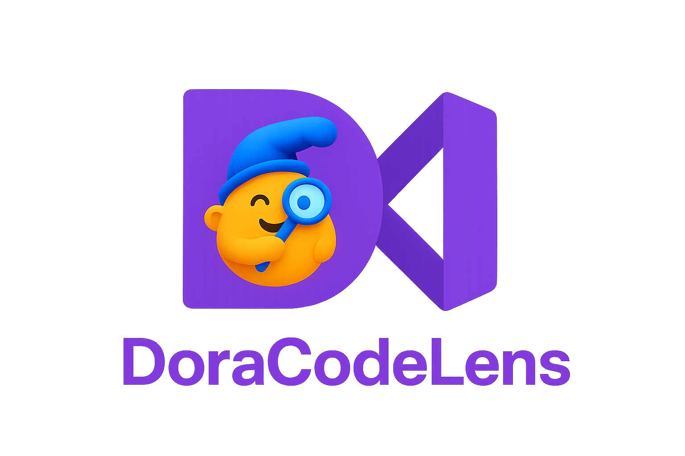

# DoraCodeLens VS Code Extension




Every developer knows the pain of diving into an unfamiliar codebase — endless scrolling, manual tracing, and juggling scattered tools. We wanted to replace that friction with clarity: a single workspace inside VS Code where a Python project comes alive as a visual mind map.

That’s how DoraCodeLens was born.

What it does
It analyzes Python projects and delivers:

🗺️ Mind maps of modules, classes, methods, and functions — annotated with real-time complexity scores.
🗃️ Database-schema diagrams, extracted directly from ORM models.
📊 Git analytics, including contributor timelines and activity stats.
⚡ Productivity tools such as JSON minify/beautify and a tree viewer.
All of this runs right inside the editor — no context switching, no clutter.


## Features

### 🔍 **Comprehensive Code Analysis**

- **Full Project Analysis**: Complete codebase analysis with interactive visualizations
- **Current File Analysis**: Quick insights for the file you're working on
- **Complexity Metrics**: Color-coded complexity indicators (🟢 Low, 🟡 Medium, 🔴 High)
- **Framework Detection**: Automatic detection of Django, Flask, FastAPI patterns

### 📊 **Interactive Visualizations**

- **Module Graph View**: Interactive dependency graphs with styled module cards
- **Tech Stack Dashboard**: Categorized view of detected technologies and frameworks
- **Database Schema Graphs**: Visual representation of database relationships
- **Git Analytics Charts**: Contributor statistics and commit timeline visualizations

### 🔧 **Developer Productivity Tools**

- **Code Lens Integration**: Inline complexity annotations with toggle controls
- **JSON Utilities**: Format, validate, and explore JSON with tree view
- **Context Menu Integration**: Organized right-click menu for quick access
- **Export Capabilities**: Export analysis results in multiple formats (JSON, CSV, HTML, PNG)

### 📈 **Git Analytics & Team Insights**

- **Author Statistics**: Detailed contributor analysis with commit counts and line changes
- **Module Contributions**: Track who works on which parts of your codebase
- **Commit Timeline**: Visual timeline of development activity
- **Code Ownership**: Identify primary maintainers of each module

### 🗄️ **Database Schema Analysis**

- **Schema Visualization**: Interactive graphs showing table relationships
- **SQL Extraction**: Parse and categorize SQL statements from your codebase
- **Model Analysis**: Support for Django ORM and SQLAlchemy models
- **Migration Tracking**: Analyze database migration files

## Usage

### Quick Start

1. **Install the Extension**

   - Open VS Code Extensions panel (`Ctrl+Shift+X`)
   - Search for "DoraCodeLens"
   - Click Install and reload VS Code

2. **Analyze Your Project**

   - Open a Python project in VS Code
   - Right-click on any Python file
   - Select **DoraCodeLens** from the context menu

3. **Explore Analysis Options**

   ```
   DoraCodeLens ►
   ├── Full Code Analysis
   │   ├── Tech Stack          # View detected frameworks & libraries
   │   ├── Mind Map            # Interactive module dependency graph
   │   └── JSON View           # Raw analysis data
   ├── Current File Analysis   # Quick analysis of current file
   ├── Code Lens (On/Off)      # Toggle inline complexity annotations
   ├── Git Analytics ►
   │   ├── Author Statistics   # Team contribution analysis
   │   ├── Module Contributions # Module-wise Git activity
   │   └── Commit Timeline     # Development timeline
   ├── Database Schema ►
   │   ├── Graph View          # Visual schema representation
   │   └── Raw SQL             # Extracted SQL statements
   └── JSON Utilities ►
       ├── JSON Format         # Beautify JSON in editor
       └── JSON Tree View      # Expandable JSON explorer
   ```

4. **Navigate the Tabbed Interface**
   - Analysis results open in a comprehensive tabbed interface
   - Switch between different views seamlessly
   - Export results for documentation or sharing

## Configuration & Settings

DoraCodeLens provides extensive configuration options through VS Code settings:

### Analysis Settings

- **Python Path**: Configure custom Python interpreter path
- **Analysis Timeout**: Set timeout for analysis operations (30-600 seconds)
- **Debug Logging**: Enable detailed logging for troubleshooting

### Code Lens Settings

- **Complexity Thresholds**: Customize low/medium/high complexity boundaries
- **Display Options**: Toggle complexity indicators and suggestions
- **Max Suggestions**: Control number of suggestions per function

### Guidance System

- **Preferred Analysis Type**: Set default analysis mode (current-file/full-project)
- **Auto-run Analysis**: Automatically analyze when Code Lens is enabled
- **Welcome Messages**: Control first-time user guidance

### Access Settings

1. Open VS Code Settings (`Ctrl+,`)
2. Search for "DoraCodeLens"
3. Customize options to fit your workflow

## Supported Frameworks & Technologies

### Web Frameworks

- **Django**: Models, views, URLs, admin interface, migrations
- **Flask**: Routes, blueprints, SQLAlchemy integration, templates
- **FastAPI**: Routes, dependency injection, Pydantic models, async patterns

### Database Technologies

- **Django ORM**: Model relationships, migrations, admin integration
- **SQLAlchemy**: Model definitions, relationships, query patterns
- **Raw SQL**: DDL, DML, DQL statement parsing and categorization

### Development Tools

- **Git Integration**: Repository analysis, author statistics, commit tracking
- **JSON Processing**: Validation, formatting, tree exploration
- **Testing Frameworks**: pytest, unittest pattern detection
- **Package Management**: requirements.txt, pyproject.toml, Pipfile support

## Command Palette Integration

Access DoraCodeLens features through the VS Code Command Palette (`Ctrl+Shift+P`):

### Analysis Commands

- `DoraCodeLens: Full Code Analysis` - Complete project analysis
- `DoraCodeLens: Current File Analysis` - Analyze current file only
- `DoraCodeLens: Refresh Full Code Analysis` - Force refresh analysis cache
- `DoraCodeLens: Database Schema Analysis` - Analyze database structure
- `DoraCodeLens: Git Analytics` - Generate Git repository insights

### Code Lens Commands

- `DoraCodeLens: Code Lens (On)` - Enable inline complexity annotations
- `DoraCodeLens: Code Lens (Off)` - Disable Code Lens display
- `DoraCodeLens: Apply Code Lens Suggestion` - Apply suggested improvements
- `DoraCodeLens: Show Code Lens Suggestion Details` - View detailed suggestions

### JSON Utilities

- `DoraCodeLens: JSON Format` - Format JSON in current editor
- `DoraCodeLens: JSON Tree View` - Open JSON tree explorer
- `DoraCodeLens: JSON Fix (Python Dict)` - Convert Python dict to JSON
- `DoraCodeLens: JSON Minify` - Compress JSON content

### Utility Commands

- `DoraCodeLens: Setup Python Path` - Configure Python interpreter
- `DoraCodeLens: Auto-Detect Python Path` - Automatically find Python
- `DoraCodeLens: Clear Cache` - Clear analysis cache
- `DoraCodeLens: Cancel Analysis` - Stop running analysis
- `DoraCodeLens: Settings` - Open extension settings

## Example Projects

The `examples/` directory contains sample projects demonstrating the extension's capabilities:

- **django-ecommerce**: Comprehensive Django e-commerce project with complex database schema, REST APIs, and Docker setup
- **django-todo**: Django todo app with models, views, and URL patterns
- **flask-todo**: Flask todo app using Blueprints and SQLAlchemy
- **fastapi-todo**: FastAPI todo app with dependency injection and modern async patterns

Each example includes setup instructions and demonstrates different framework patterns that DoraCodeLens can analyze.

## Troubleshooting

### Common Issues

**Extension not activating**

- Ensure you have a Python project open with `.py` files
- Check that Python 3.8+ is installed and accessible
- Verify workspace contains `requirements.txt`, `pyproject.toml`, or Python files
- Try reloading VS Code window (`Ctrl+Shift+P` → "Developer: Reload Window")

**Analysis fails or times out**

- Check Python interpreter path in DoraCodeLens settings
- Increase analysis timeout in settings (default: 120 seconds)
- Try Current File Analysis instead of Full Code Analysis for large projects
- Review VS Code Output panel for detailed error messages

**Code Lens not appearing**

- Ensure Code Lens is enabled (`DoraCodeLens: Code Lens (On)`)
- Check that you're in a Python file (`.py` extension)
- Run analysis first to populate Code Lens data
- Verify complexity thresholds in settings aren't too restrictive

**Git Analytics empty**

- Ensure the project is a Git repository (`git init` if needed)
- Check that Git is installed and accessible from command line
- Verify the repository has commit history
- Try analyzing a specific date range if history is very large

**Database Schema not detected**

- Ensure you have Django models (`models.py`) or SQLAlchemy models
- Check that model files are in standard locations
- Verify database models follow standard ORM patterns
- Look for SQL files in migrations or schema directories

**JSON utilities not working**

- Ensure the content is valid JSON syntax
- Try formatting smaller JSON sections first
- Check that the file has proper JSON structure
- Use JSON Fix feature for Python dictionary conversion

**Performance issues with large projects**

- Use Current File Analysis instead of Full Code Analysis
- Enable analysis caching in settings
- Close other resource-intensive VS Code extensions
- Consider analyzing specific directories rather than entire project
- Ensure sufficient RAM (4GB+ recommended for large projects)

### Getting Help

1. **Check Extension Output**

   - Open VS Code Output panel (`View` → `Output`)
   - Select "DoraCodeLens" from the dropdown
   - Review error messages and debug information

2. **Enable Debug Logging**

   - Open VS Code Settings (`Ctrl+,`)
   - Search for "DoraCodeLens debug"
   - Enable "Enable Debug Logging"
   - Reproduce the issue and check output


### System Requirements

- **VS Code**: Version 1.74.0 or higher
- **Python**: Version 3.8 or higher
- **Git**: Any recent version (for Git analytics features)
- **Memory**: At least 4GB RAM recommended for large projects
- **Storage**: 100MB free space for extension and caching
- **Network**: Internet connection for initial Python package installation

## License

This project is licensed under the MIT License - see the [LICENSE](LICENSE) file for details.

## Acknowledgments

- [VS Code Extension API](https://code.visualstudio.com/api) for integration capabilities
- [Cytoscape.js](https://cytoscape.org/) for graph visualization
- [Radon](https://radon.readthedocs.io/) for complexity analysis

## Changelog

See [CHANGELOG.md](CHANGELOG.md) for version history and updates.
